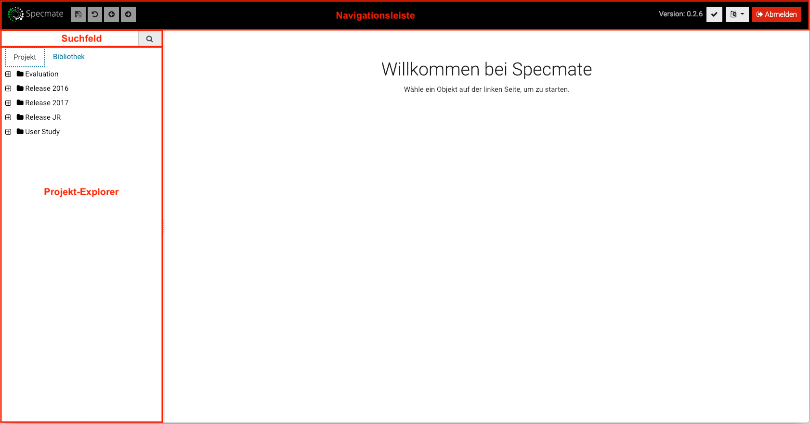
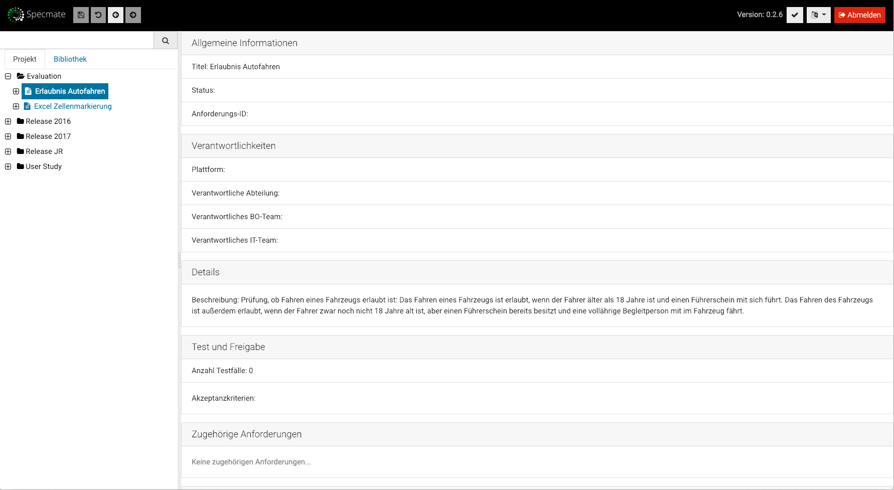
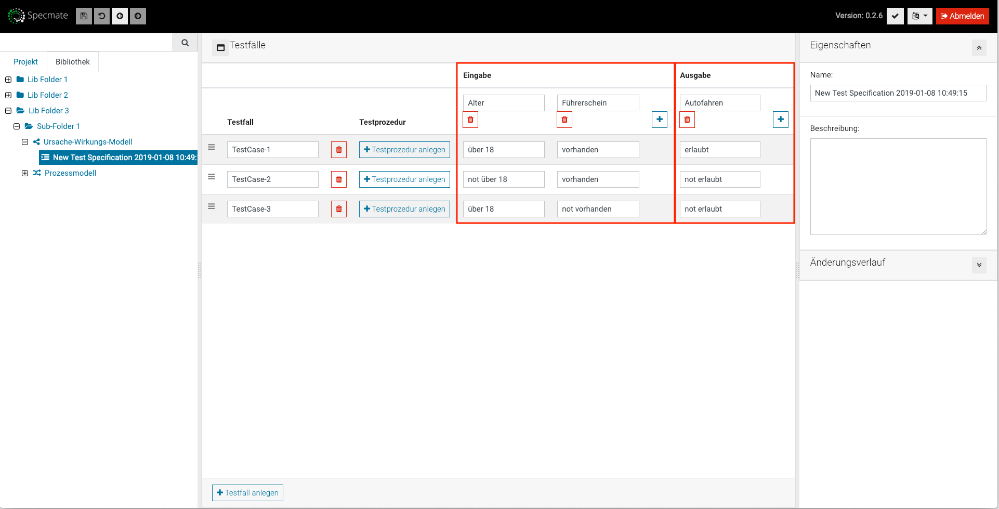
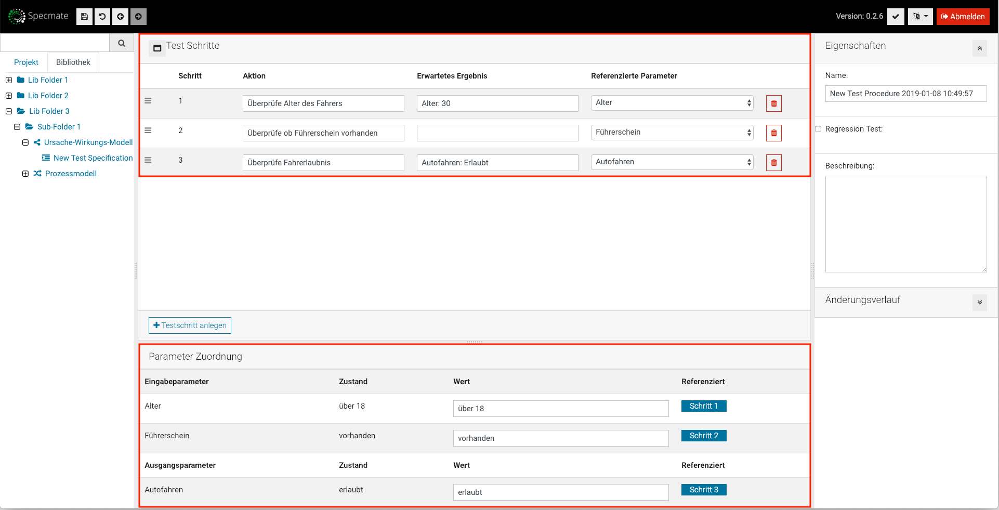

# Specmate Leitfaden für den Einstieg
## Inhaltsverzeichnis

- [Installation, Konfiguration & Inbetriebnahme](#installation-konfiguration--inbetriebnahme)
  * [Installation](#installation)
  * [Konfiguration](#konfiguration)
    + [Neue Projekte hinzufügen](#neue-projekte-hinzufügen)
    + [Hinzufügen von Anforderungsquellen](#hinzufügen-von-anforderungsquellen)
  * [Start von Specmate](#start-von-specmate)
- [Verwendung](#verwendung)
  * [Login](#login)
  * [Übersicht](#übersicht)
  * [Modellieren von Anforderungen](#modellieren-von-anforderungen)
    + [Modellierung mit Ursachen-Wirkungs-Diagrammen](#modellierung-mit-ursache-wirkungs-diagrammen-ceg)
    + [Modellierung mit Prozessmodellen](#modellierung-mit-prozessmodellen)
    + [Grundlegende Funktionen, die auf beiden Editoren verfügbar sind](#grundlegende-funktionen-die-auf-beiden-editoren-verfügbar-sind)
  * [Generierung einer Testfall-Spezifikation](#generierung-einer-testfall-spezifikation)
  * [Erstellen einer Testprozedur](#erstellen-einer-testprozedur)
   

# Installation, Konfiguration und Inbetriebnahme

## Installation

- Stellen Sie sicher, dass Java 1.8 installiert ist. Wenn nicht, erhalten Sie ein Java 1.8 Release, z.B. von [hier](https://www.oracle.com/technetwork/java/javase/downloads/jdk8-downloads-2133151.html). Um herauszufinden, welche Java-Version Sie gerade verwenden, geben Sie in eine Konsole java -version ein.

- Besorgen Sie sich die neueste Version von Specmate auf der Download-Seite.

- Entpacken Sie Specmate in einen Ordner Ihrer Wahl.

- Unter Windows führen Sie start.bat aus, unter Linux/Mac führen Sie start.sh aus.

## Konfiguration
Specmate wird über die Datei specmate-config.properties konfiguriert. Eine Beispiel-Konfigurationsdatei erhalten Sie [hier](https://github.com/junkerm/specmate/blob/develop/bundles/specmate-config/config/specmate-config.properties).

### Neue Projekte hinzufügen
Specmate ist in Projekte gegliedert. Ein Projekt stellt einen Bereich für Anforderungen, Modelle und Tests dar, auf die eine Gruppe von Benutzern zugreifen kann. 
Für jedes Projekt können Sie eine Anforderungsquelle und ein Exportziel für Prüfabläufe konfigurieren. 
Um ein neues Projekt hinzuzufügen, fügen Sie die Projekt-ID über die Eigenschaft project.projects in die Projektliste ein.

Beispiel:
```
project.projects = myproject1, myproject2
```

### Hinzufügen von Anforderungsquellen
Specmate unterstützt verschiedene Arten von Anforderungsquellen:
- Anforderungsdateien
- JIRA
- HP PPM

Derzeit definieren die Anforderungsquellen auch, welche Benutzer auf das Projekt zugreifen können. Wenn Sie beispielsweise eine JIRA-Anforderungsquelle konfigurieren, kann jeder Benutzer, der Zugriff auf die JIRA-Instanz hat, auf das Projekt zugreifen.

##### Anforderung aus Dateien
Um eine Anforderungsdateiquelle für ein Projekt zu konfigurieren, geben Sie den Speicherort eines Ordners auf Ihrem Dateisystem an. Specmate sucht in diesem Ordner nach *.txt-Dateien und importiert die in diesen Dateien enthaltenen Anforderungen.
Das Format der Anforderungsdateien ist wie folgt:

```
(Anforderungs-ID)
[Anforderungstext (darf keine Leerzeilen enthalten)]

(Anforderungs-ID)
[Anforderungstext (darf keine Leerzeilen enthalten)]
...
```

Der Speicherort einer Anforderungsdatei für ein Projekt ist wie folgt konfiguriert:

```
project.[project-id].connector.pid = com.specmate.FileConnector
project.[project-id].connector.fileConnector.folder = [Speicherort im Dateisystem (Auf Windows: "\\" statt "\"]
project.[project-id].connector.fileConnector.user = [Benutzername]
project.[project-id].connector.fileConnector.password = [Passwort]
project.[project-id].connector.connectorID =[project-ID]
```

##### JIRA Import
Um Anforderungen aus Jira zu importieren, können Sie die folgenden Eigenschaften in der Konfigurationsdatei angeben.

```
project.projects = [project-ID]
project[project-ID].connector.pid = com.specmate.connectors.jira.jira.JiraConnector
project.[project-ID].connector.jira.url = [JIRA URL]
project.[project-ID].connector.jira.project = [JIRA PROJEKT]
project.[project-ID].connector.jira.username = [TECHNISCHER BENUTZERNAME]
project.[project-ID].connector.jira.password = [TECHNISCHES BENUTZERPASSWORT]
project[project-ID].connector.connectorID = [project-ID].
```

## Start von Specmate
Um specmate zu starten, öffnen Sie ein Terminal und geben Sie Folgendes ein
```properties 
java -jar specmate.jar --configurationFile [Pfad-zu-ihrer-config-file]
```
Jetzt können Sie einen Browser öffnen und zu http://localhost:8080 navigieren, um auf die Startseite von Specmate zuzugreifen.
 
# Verwendung

## Login
Wählen Sie auf der Startseite von Specmate ein Projekt aus und geben Sie einen gültigen Login für dieses Projekt ein. Beachten Sie, dass die Anmeldeinformationen im Allgemeinen spezifisch für ein bestimmtes Projekt sind und nicht für jedes Projekt funktionieren.

## Übersicht
Nach dem Anmelden bei Specmate sehen Sie folgende Ansicht



- Auf der linken Seite sehen Sie den Projekt-Explorer. Der Projekt-Explorer zeigt die importierten Anforderungen in einer Baumstruktur an. Sie können durch den Baum navigieren (d.h. die Ordner öffnen) und eine Anforderung auswählen.
- Im Projekt-Explorer können Sie zwischen der Projektansicht mit den importierten Anforderungen und der Bibliotheksansicht wechseln. In der Projektansicht werden nur die Anforderungen und die zugehörigen Information angezeigt, es können keine neuen Ordner erstellt werden. In der Bibliothek können Sie Ordner und Modelle frei hinzufügen. Sowohl in der Projektansicht als auch in der Bibliotheksansicht können Modelle erstellt werden.
- Über dem Projekt-Explorer befindet sich ein Suchfeld. Nach der Eingabe eines Suchwortes (aus dem Titel der Anforderung oder User Story) oder der entsprechenden PPM/Jira-ID zeigt der Projekt-Explorer Anforderungen und Modelle an, die dem Suchwort entsprechen. Beachten Sie, dass die Bibliothek derzeit nicht in die Suche miteinbezogen ist.
- Im oberen Teil des Bildschirms direkt neben dem Specmate-Logo finden Sie Schaltflächen zum Speichern des aktuell geöffneten Elements, zur Navigation und zum Zurücksetzen der letzten Aktion in einem Modell-Editor.

Wenn eine Anforderung in der Projektansicht ausgewählt ist, wird Ihnen die folgende Ansicht gezeigt



In dieser Ansicht können Sie alle Informationen über die Anforderungen einsehen, sowie zugehörige Modelle bzw. Testspezifikationen erstellen oder bereits erstellte Modelle bzw. Testspezifikationen einsehen.


Wenn ein Ordner in der Bibliotheksansicht ausgewählt ist, wird Ihnen die folgende Ansicht angezeigt


- Im ersten Abschnitt können Sie Details über den ausgewählten Ordner abrufen.
- Das Ändern der Struktur der Bibliothek (z.B. Hinzufügen/Entfernen von Ordnern) kann im Abschnitt *Unterordner* vorgenommen werden.
- Die Ordnerstruktur auf oberster Ebene der Bibliothek wird in der Projektkonfiguration fest vorgegeben und kann somit nicht in Specmate selbst geändert werden. 
- Das Erstellen/Anzeigen von Ursache-Wirkungs-Diagrammen oder Prozessmodellen kann im jeweiligen Abschnitt erfolgen. 


## Modellieren von Anforderungen
Für das Modellieren von Anforderungen haben Sie die Wahl zwischen Ursache-Wirkungs-Diagrammen und Prozessmodellen. Je nachdem, ob die Art der Anforderung regelbasiert ("Wenn dies und das, dann das Folgende... mit Ausnahme von ... dann...") oder prozessbasiert ist ("Zuerst gibt der Benutzer A ein. Aufgrund der Eingabe gibt das System entweder B oder C ein. Danach fragt das System den Benutzer nach D, danach..."), können Sie die entsprechende Modellierungstechnik auswählen. Bei der Modellierung regelbasierter Anforderungen werden Ursache-Wirkungs-Diagramme verwendet, während prozessbasierte Anforderungen mit Prozessmodellen dargestellt werden können.

### Modellierung mit Ursache-Wirkungs-Diagrammen (Cause-Effect-Graph = CEG)


Nach dem Öffnen des Ursache-Wirkungs-Editors wird Ihnen ein Modellierungsbereich in der Mitte präsentiert, in dem Sie Ihr CEG erstellen können.
Um ein CEG zu modellieren, können Sie ein Werkzeug aus der Toolbox auswählen.
Nachdem Sie *Knoten* aus der Toolbox ausgewählt haben, können Sie im Modellierungsbereich klicken, um einen neuen Knoten anzulegen. 
Standardmäßig ist der Name des Knotens *variable* und die Bedingung ist auf *is present* gesetzt. Sie können die Attribute des ausgewählten Knotens auf der rechten Seite im Abschnitt *Eigenschaften* ändern. 

Eine bewährte Vorgehensweise ist, die Variablen immer als positive Aussagen zu deklarieren (z.B. *Türen zugesperrt: wahr* statt *Türen nicht zugesperrt: nicht wahr*).
 
Um zwei Knoten zu verbinden, wählen Sie das Werkzeug *Verbindung* aus, anschließend den Knoten, der die Ursache darstellen soll und dann den Knoten, der die Wirkung darstellen soll. 
Wenn eine Verbindung erstellt und ausgewählt wird, haben Sie die Möglichkeit, die Verbindung zu negieren.


Wenn ein Knoten mehrere eingehende Verbindungen hat, können Sie den Typ des Knotens ändern. 
Abhängig vom Typ des Knotens können eingehende Verbindungen als ODER-Verknüpfungen oder UND-Verknüpfungen definiert werden. Wenn der Typ eines Knotens auf AND gesetzt ist, müssen alle Vorgängerknoten mit einer Verbindung zu dem jeweiligen Knoten bereits erfüllt sein, damit der Knoten erfüllt wird. 
Es muss nur ein einziger direkter Vorgänger erfüllt werden, wenn der Typ eines Knotens auf OR gesetzt ist.


### Modellierung mit Prozessmodellen
Um Prozessmodelle zu modellieren öffnen Sie den zugehörigen Editor. 
Mit dem *Schritt*-Werkzeug können Sie dem Modell eine Aktion hinzufügen. Jedes Modell muss einen Startknoten und mindestens einen Endknoten haben.
Je nachdem, welchen Knotentyp Sie anlegen möchten, wählen Sie aus der Toolbox entweder das *Start* oder das *Ende* Werkzeug.

Um die Komplexität des Modells zu erhöhen, können Sie einen Entscheidungsknoten hinzufügen, indem Sie das Werkzeug *Entscheidung* auswählen.  
Um zwei Elemente zu verbinden, müssen Sie das Werkzeug *Verbindung* auswählen und die Knoten auswählen, die Sie verbinden möchten. 
Für jede Verbindung können Sie eine Bedingung setzen, die die Variable erfüllen muss. Bei der Verwendung des Entscheidungsknotens können Sie den Zustand der ausgehenden Verbindungen angeben, die erfüllt werden müssen, um der spezifischen Verbindung im Modell zu folgen. 
Wenn ein Knoten ausgewählt ist, zeigt Specmate die Eigenschaften des Knotens auf der rechten Seite an. Außerdem können Sie das erwartete Ergebnis dieses Schrittes im Eigenschaftenbereich angeben.

Die folgende Abbildung zeigt einen Prozess eines Geldautomaten, der mit dem Prozessmodell-Editor modelliert wurde.


### Grundlegende Funktionen, die in beiden Editoren verfügbar sind
Wenn Sie alle Elemente im Editor löschen möchten, können Sie auf die Schaltfläche *Alle Inhalte entfernen* in der Symbolleiste klicken. 
Wenn Sie das Werkzeug *Löschen* wählen, können Sie bestimmte Elemente aus dem Modell entfernen. Wenn das Werkzeug ausgewählt ist, können Sie auf das Element klicken, das Sie entfernen möchten. 
Sie haben die Möglichkeit, die Elemente im Editor neu zu ordnen, wenn Sie das Werkzeug *Auswählen* aus der Toolbox auswählen. 
  
Auf der rechten Seite des Editors können Sie den Namen des Modells ändern und eine Beschreibung hinzufügen. Sie können auch eine Beschreibung für jeden Knoten im Modell hinzufügen. Im Abschnitt *Links & Actions* können Sie zur Anforderung zurückkehren als auch die Beschreibung der Anforderung ansehen, für die Sie gerade ein Modell anlegen. 
Links zu bereits generierten Testspezifikationen werden ebenfalls angezeigt. 

Die Spalte Traces zeigt alle Anforderungen, die mit dem ausgewählten Knoten bzw. Schritt verbunden sind. Darüber hinaus können Sie Anforderungen hinzufügen, indem Sie im Suchfeld nach ihnen suchen. Es kann sowohl nach der ID als auch nach dem Namen der Anforderung gesucht werden. Die angezeigten Anforderungen können dann durch Anklicken dem ausgewählten Knoten bzw. Schritt hinzugefügt werden. Bereits hinzugefügte Anforderungen können durch Anklicken des entsprechenden Papierkorb Symbols gelöscht werden. Spätere Änderungen am Modell können zu Anpassungen der Regressionstests führen. Durch das Anzeigen der verbundenen Anforderungen können Sie feststellen welche Regressionstests angepasst werden müssen.
Im letzten Abschnitt *Änderungsverlauf* können Sie sehen, welcher Benutzer Änderungen am Diagramm vorgenommen hat. Wenn es Fehler im erstellten Modell gibt, zeigt Specmate diese über der Spalte *Änderungsverlauf* an. 

## Generierung einer Testfall-Spezifikation

Sie haben die Möglichkeit, eine Testfall-Spezifikation manuell zu erstellen oder automatisch aus einem Modell zu generieren. Anhand des Symbols der Spezifikation im Projekt-Explorer können Sie sehen, ob sie automatisch oder manuell generiert wird. 

Manuell erstellt:   Automatisch generiert:  

Der Name der Testfall-Spezifikation basiert auf dem Datum und der Uhrzeit, zu der die Spezifikation angelegt wurde. Sie haben die Möglichkeit, den Namen der Spezifikation zu ändern und eine Beschreibung hinzuzufügen. 
Die Spezifikation besteht aus mehreren Testfällen, wobei jeder Testfall eine bestimmte Konfiguration hat. Ein Testfall weist jeder Variable einen Wert zu. In bestimmten Testfällen lässt Specmate den Wert einer Variable frei. Ist dies der Fall, ist die Variable nicht auf einen bestimmten Wert beschränkt.
Für die Erstellung der Spezifikation werden Regeln verwendet, um eine optimales Verhältnis zwischen Testabdeckung und Anzahl der Testfälle sicherzustellen. Dadurch wird verhindert, dass die Anzahl der Testfälle bei einem Zuwachs der Ursachen exponentiell wächst.

Die Knoten, die sich in der Spalte *Eingabe* befinden, sind Variablen, die die Ursachen aus dem Modell darstellen. Unterhalb der Spalte *Ausgabe* finden Sie die Variablen, die die Wirkungen darstellen. Es können auch weitere Ein- und Ausgabevariablen hinzugefügt oder bestehende gelöscht werden.

Sie können einen Testfall auch löschen, wenn Sie auf das Papierkorbsymbol des jeweiligen Testfalls klicken.
Wenn Sie Testfälle manuell hinzufügen möchten, können Sie die Schaltfläche *Testfall erstellen* im unteren Bereich drücken. 
Die Reihenfolge der Testfälle kann per Drag & Drop geändert werden. 



## Erstellen einer Testprozedur
Aus jedem Testfall können Sie eine Testprozedur anlegen. Hier können Sie alle notwendigen Schritte für den jeweiligen Testfall definieren. Bei der Modellierung eines CEG muss die Testprozedur manuell generiert werden. Das Erzeugen einer Testfall-Spezifikation aus einem Prozessdiagramm führt zu automatisch erstellten Testprozeduren. 
Sie können einen weiteren Schritt hinzufügen, indem Sie die Schaltfläche *Testschritt anlegen* drücken. In jedem Schritt des Testverfahrens können Sie auf Parameter aus dem erstellten Modell verweisen. Die Parameter aus dem Modell können in der *Parameter Zuordnung* auf einen bestimmten Wert eingestellt werden. 
Wenn die Erstellung einer Testprozedur abgeschlossen ist, können Sie sie mit der Schaltfläche auf der rechten Seite exportieren. Sie können auch eine bereits erstellte Testprozedur öffnen und bearbeiten, indem Sie sie im Projekt-Explorer oder in der Anforderungsübersicht anklicken. Darüber hinaus haben Sie die Möglichkeit, eine Testprozedur als Regressionstest zu kennzeichnen. 
Die Reihenfolge der Prüfschritte kann per Drag & Drop geändert werden und Sie können auch einen Prüfschritt löschen, indem Sie auf das Papierkorbsymbol des jeweiligen Schrittes klicken.


